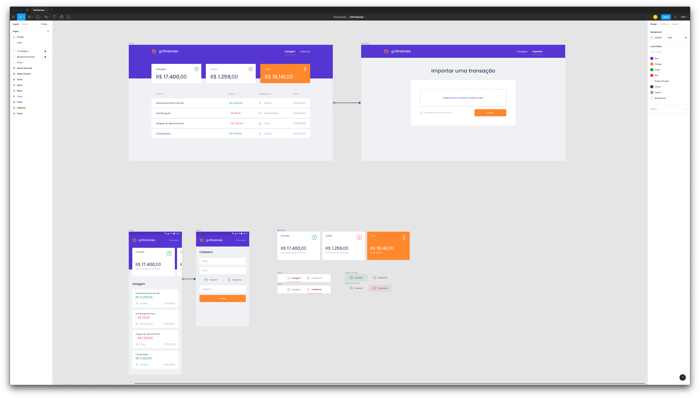

<h3 align="center">
  Challenge 07: GoFinances Web
</h3>

  

### 🚀 About the challenge

In this challenge, you must continue to develop the transaction management application, GoFinances. Now you will practice what you have learned so far in React.js along with TypeScript, using routes and sending files by form.

This will be an application that will connect to your Challenge 06 backend, and display the transactions created and allow the import of a CSV file to generate new records in the database.

### Tests Specification

- **`should be able to list the total balance inside the cards`**: For this test to pass, your application must allow a transaction to be created, and return a json with the created transaction.For this test to pass, your application must allow cards containing the total income, outcome and the total subtraction of income - outcome to be displayed on your Dashboard, which are returned by your backend balance.

- **`should be able to list the transactions`**: For this test to pass, your application must allow all transactions that are returned from your backend to be listed within a table.

- **`should be able to navigate to the import page`**: For this test to pass, you must allow the page change through the Header, by the button that contains the name Importar.

- **`should be able to upload a file`**: For this test to pass, you must allow a file to be sent via the drag-n-drop component on the import page, and it is possible to display the name of the file sent to the input.

### 🖥 Layout
<a target="_blank" rel="noopener noreferrer" href="https://www.figma.com/file/EgOhyj1Inz14dhWGVhRlhr/GoFinances?node-id=1%3A863">Link to Figma</a>

---

Made with ❤️ by morikawa77
